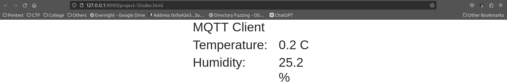
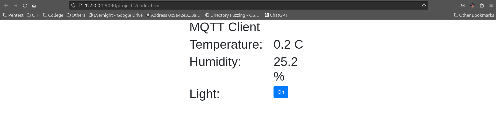

# Final Project Integrasi Sistem

### Kelompok 14
| Nama | NRP |
|----|-----|
| Ong Valencio Jesse P. | 5027221002 |
| Subkhan Mas Udi | 5027221044 |

## Project 1
Project 1 membahas tentang pengembangan sebuah sistem pengukuran suhu dan kelembapan suatu ruangan dengan mengintegrasikan sensor DHT dengan NodeMCU. Output dari sensor DHT tersebutlah yang diteruskan ke broker MQTT, yang lalu diteruskan dan ditampilkan dalam bentuk webpage.

### Attahcments
- <a href="project-1/MQTT2Wemos.ino">MQTT2Wemos.ino</a>
- <a href="project-1/index.html">index.html</a>

### MQTT2Wemos.ino
```
#include <Adafruit_Sensor.h>
#include <DHT.h>
#include <DHT_U.h>
#include <ESP8266WiFi.h>
#include <PubSubClient.h>

const char* ssid = "L y n n";
const char* pswd = "Hazelnut";

const char* mqtt_server = "167.172.87.186"; // IP Broker
const char* topic = "/kel14/room/temperature"; //Topic

long timeBetweenMessages = 1000 * 20 * 1;

WiFiClient espClient;
PubSubClient client(espClient);
long lastMsg = 0;
int value = 0;

int status = WL_IDLE_STATUS;

#define DHTPIN 5     // Digital pin connected to the DHT sensor 

#define DHTTYPE    DHT11     // DHT 11
DHT_Unified dht(DHTPIN, DHTTYPE);

uint32_t delayMS;
```
Bagian kode di atas memuat library yang digunakan untuk kebutuhan project, termasuk membaca sensor DHT, koneksi wifi, dan protokol MQTT. Selain itu juga terdapat ssid dan pswd yang telah ter-define untuk melakukan koneksi ke jaringan dengan credential tersebut. Terdapat juga IP broker MQTT dan topik yang ditentukan. Terakhir terdapat pin digital yang digunakan untuk terhubung ke sensor DHT, serta tipe sensor DHT yang digunakan.

```
void setup_wifi() {
  delay(10);
  Serial.println();
  Serial.print("Connecting to ");
  Serial.println(ssid);
  WiFi.begin(ssid, pswd);
  while (WiFi.status() != WL_CONNECTED) {
    delay(500);
    Serial.print(".");
  }
  Serial.println("");
  Serial.println("WiFi connected");
  Serial.println("IP address: ");
  Serial.println(WiFi.localIP());
}
```
Function `setup_wifi()` digunakan untuk menghubungkan ESP8266 ke jaringan WiFi yang ditentukan. Setelah berhasil terhubung, akan menampilkan alamat IP yang diberikan oleh router.

```
void callback(char* topic, byte* payload, unsigned int length) {
  Serial.print("Message arrived [");
  Serial.print(topic);
  Serial.print("] ");
  for (int i = 0; i < length; i++) {
    Serial.print((char)payload[i]);
  }
  Serial.println();

  if ((char)payload[0] == '1') {
    digitalWrite(BUILTIN_LED, LOW);
  } else {
    digitalWrite(BUILTIN_LED, HIGH);
  }
}
```
Function `callback()` digunakan setiap kali ada pesan baru yang diterima dari broker MQTT. Pesan akan dicetak ke Serial Monitor. Jika pesan adalah '1', LED bawaan akan dinyalakan, jika tidak maka akan dimatikan.

```
String macToStr(const uint8_t* mac) {
  String result;
  for (int i = 0; i < 6; ++i) {
    result += String(mac[i], 16);
    if (i < 5)
      result += ':';
  }
  return result;
}
```
Function `macToStr()` digunakan untuk mengubah alamat MAC yang berupa byte array menjadi string yang bisa dibaca.

```
String composeClientID() {
  uint8_t mac[6];
  WiFi.macAddress(mac);
  String clientId;
  clientId += "esp-";
  clientId += macToStr(mac);
  return clientId;
}
```
Function `composeClientID()` digunakan untuk membuat client ID unik menggunakan alamat MAC dari ESP8266.

```
void reconnect() {
  while (!client.connected()) {
    Serial.print("Attempting MQTT connection...");
    String clientId = composeClientID();
    clientId += "-";
    clientId += String(micros() & 0xff, 16);

    if (client.connect(clientId.c_str(), username, password)) {
      Serial.println("connected");
      String subscription;
      subscription += topic;
      subscription += "/";
      subscription += composeClientID();
      subscription += "/in";
      client.subscribe(subscription.c_str());
      Serial.print("subscribed to : ");
      Serial.println(subscription);
    } else {
      Serial.print("failed, rc=");
      Serial.print(client.state());
      Serial.print(" wifi=");
      Serial.print(WiFi.status());
      Serial.println(" try again in 5 seconds");
      delay(5000);
    }
  }
}
```
Function `reconnect()` digunakan untuk menghubungkan kembali ke broker MQTT jika koneksi terputus. Jika berhasil, akan melakukan subscribe ke topik yang telah ditentukan.

```
void setup() {
  Serial.begin(115200);
  dht.begin();
  setup_wifi();
  client.setServer(mqtt_server, 1883);
  client.setCallback(callback);

  Serial.println(F("DHTxx Unified Sensor Example"));
  sensor_t sensor;
  dht.temperature().getSensor(&sensor);
  Serial.println(F("------------------------------------"));
  Serial.println(F("Temperature Sensor"));
  Serial.print  (F("Sensor Type: ")); Serial.println(sensor.name);
  Serial.print  (F("Driver Ver:  ")); Serial.println(sensor.version);
  Serial.print  (F("Unique ID:   ")); Serial.println(sensor.sensor_id);
  Serial.print  (F("Max Value:   ")); Serial.print(sensor.max_value); Serial.println(F("°C"));
  Serial.print  (F("Min Value:   ")); Serial.print(sensor.min_value); Serial.println(F("°C"));
  Serial.print  (F("Resolution:  ")); Serial.print(sensor.resolution); Serial.println(F("°C"));
  Serial.println(F("------------------------------------"));
  dht.humidity().getSensor(&sensor);
  Serial.println(F("Humidity Sensor"));
  Serial.print  (F("Sensor Type: ")); Serial.println(sensor.name);
  Serial.print  (F("Driver Ver:  ")); Serial.println(sensor.version);
  Serial.print  (F("Unique ID:   ")); Serial.println(sensor.sensor_id);
  Serial.print  (F("Max Value:   ")); Serial.print(sensor.max_value); Serial.println(F("%"));
  Serial.print  (F("Min Value:   ")); Serial.print(sensor.min_value); Serial.println(F("%"));
  Serial.print  (F("Resolution:  ")); Serial.print(sensor.resolution); Serial.println(F("%"));
  Serial.println(F("------------------------------------"));
  delayMS = 30000;
}
```
Function `setup()` menginisialisasi komunikasi Serial, sensor DHT, koneksi WiFi, dan koneksi MQTT. Informasi sensor ditampilkan ke Serial Monitor.

```
void loop() {
  delay(delayMS);
  sensors_event_t event;
  dht.temperature().getEvent(&event);
  float temp = 0;
  if (isnan(event.temperature)) {
    Serial.println(F("Error reading temperature!"));
  } else {
    Serial.print(F("Temperature: "));
    Serial.print(event.temperature);
    Serial.println(F("°C"));
    temp = event.temperature;
  }

  dht.humidity().getEvent(&event);
  float hum = 0;
  if (isnan(event.relative_humidity)) {
    Serial.println(F("Error reading humidity!"));
  } else {
    Serial.print(F("Humidity: "));
    Serial.print(event.relative_humidity);
    Serial.println(F("%"));
    hum = event.relative_humidity;
  }

  if (!client.connected()) {
    reconnect();
  }
  client.loop();

  String payload = "{\"Temp\":";
  payload += temp;
  payload += ",\"Hum\":";
  payload += hum;
  payload += "}";
  String pubTopic;
  pubTopic += topic;
  Serial.print("Publish topic: ");
  Serial.println(pubTopic);
  Serial.print("Publish message: ");
  Serial.println(payload);
  client.publish((char*)pubTopic.c_str(), (char*)payload.c_str(), true);

  delay(5000);
}
```
Function `loop()` merupakan fungsi utama yang terus berjalan setelah setup() selesai. Ini membaca suhu dan kelembapan dari sensor, memeriksa koneksi ke broker MQTT, dan mengirim data ke broker. Jika koneksi terputus, akan mencoba menghubungkan kembali.

### index.html
```
<!doctype html>
<html lang="en">
  <head>
    <title>Title</title>
    <!-- Required meta tags -->
    <meta charset="utf-8">
    <meta name="viewport" content="width=device-width, initial-scale=1, shrink-to-fit=no">

    <!-- Bootstrap CSS -->
    <link rel="stylesheet" href="https://stackpath.bootstrapcdn.com/bootstrap/4.3.1/css/bootstrap.min.css" integrity="sha384-ggOyR0iXCbMQv3Xipma34MD+dH/1fQ784/j6cY/iJTQUOhcWr7x9JvoRxT2MZw1T" crossorigin="anonymous">
  </head>
  <body>
      <div class="continer-fluid">
          <div class="row justify-content-center">
              <div class="col-3">
                <h1>MQTT Client</h1>
              </div>
          </div>
          <div class="row justify-content-center">
            <div class="col-2">
              <h1>Temperature:</h1>
            </div>
            <div class="col-1">
                <h1 id="Room-Temp">2</h1>
              </div>
        </div>
        <div class="row justify-content-center">
            <div class="col-2">
              <h1>Humidity:</h1>
            </div>
            <div class="col-1">
                <h1 id="Room-Hum">2</h1>
              </div>
        </div>

      </div>
    <!-- Optional JavaScript -->
    <!-- jQuery first, then Popper.js, then Bootstrap JS -->
    <script src="https://code.jquery.com/jquery-3.3.1.slim.min.js" integrity="sha384-q8i/X+965DzO0rT7abK41JStQIAqVgRVzpbzo5smXKp4YfRvH+8abtTE1Pi6jizo" crossorigin="anonymous"></script>
    <script src="https://cdnjs.cloudflare.com/ajax/libs/popper.js/1.14.7/umd/popper.min.js" integrity="sha384-UO2eT0CpHqdSJQ6hJty5KVphtPhzWj9WO1clHTMGa3JDZwrnQq4sF86dIHNDz0W1" crossorigin="anonymous"></script>
    <script src="https://stackpath.bootstrapcdn.com/bootstrap/4.3.1/js/bootstrap.min.js" integrity="sha384-JjSmVgyd0p3pXB1rRibZUAYoIIy6OrQ6VrjIEaFf/nJGzIxFDsf4x0xIM+B07jRM" crossorigin="anonymous"></script>

    <!--MQTT Poho Javascript Library-->
    <script src="https://cdnjs.cloudflare.com/ajax/libs/paho-mqtt/1.0.1/mqttws31.min.js" type="text/javascript"></script>
    <script type="text/javascript">
        $(document).ready(function(){

            /** Write Your MQTT Settings Here  Start**/
            Server="167.172.87.186";
            Port="9000";
            Topic="/kel14/room/temperature";

            // Generate a random client ID
            clientID = "clientID_" + parseInt(Math.random() * 100);

            // Create a client instance
            client=new Paho.MQTT.Client(Server,Number(Port),clientID);


            // set callback handlers
            client.onConnectionLost = onConnectionLost;
            client.onMessageArrived = onMessageArrived;

            options = {
              timeout: 3,
              //Gets Called if the connection has successfully been established
              onSuccess: function () {
                  onConnect();
              },
              //Gets Called if the connection could not be established
              onFailure: function (message) {
                  console.log("On failure="+message.errorMessage);
                  onFailt(message.errorMessage);
                  //alert("Connection failed: " + message.errorMessage);
              }
            };
            // connect the client
            client.connect(options);
        });

        // called when the client connects
        function onConnect() {
            // Once a connection has been made, make a subscription and send a message.
            console.log("onConnect");
            client.subscribe(Topic);
        }

        // called when the client loses its connection
        function onConnectionLost(responseObject) {
            if (responseObject.errorCode !== 0) {
                console.log("onConnectionLost:"+responseObject.errorMessage);
            }
        }

        // called when a message arrives
        function onMessageArrived(message) {
            var MQTTDataObject = JSON.parse(message.payloadString);
            $("#Room-Temp").text(MQTTDataObject.Temp+" C");
            $("#Room-Hum").text(MQTTDataObject.Hum+" %");
            console.log(MQTTDataObject.Hum);
            console.log(MQTTDataObject.Temp);
             console.log("onMessageArrived:"+message.payloadString);
        }
    </script>
  </body>
</html>
```
File html ini merupakan code dari webpage yang kami gunakan untuk menampilkan data yang dikirim oleh sensor DHT, berupa suhu dan kelembapan ruangan.

### Dokumentasi


## Project 2
Project 2 membahas tentang pengembangan sebuah sistem pengukuran suhu dan kelembapan suatu ruangan dengan mengintegrasikan sensor DHT dengan NodeMCU. Output dari sensor DHT tersebutlah yang diteruskan ke broker MQTT, yang lalu diteruskan dan ditampilkan dalam bentuk webpage dengan tambahan fitur enable/disable lampu LED. Selain itu, project ini juga mengimplementasi penggunaan sub dan pub python script dari MQTT protocol

### Attahcments
- <a href="project-2/MQTT2Wemos.ino">MQTT2Wemos.ino</a>
- <a href="project-2/index.html">index.html</a>
- <a href="project-2/mqtt/mqtt_pub.py">mqtt_pub.py</a>
- <a href="project-2/mqtt/mqtt_sub.py">mqtt_sub.py</a>

### MQTT2Wemos.ino
```
#include <Adafruit_Sensor.h>
#include <DHT.h>
#include <DHT_U.h>
#include <ESP8266WiFi.h>
#include <PubSubClient.h>

const char* ssid = "L y n n";
const char* pswd = "Hazelnut";

const char* mqtt_server = "167.172.87.186"; // IP Broker
const char* topic = "/kel14/room/temperature"; //Topic

long timeBetweenMessages = 1000 * 20 * 1;

WiFiClient espClient;
PubSubClient client(espClient);
long lastMsg = 0;
int value = 0;

int status = WL_IDLE_STATUS;

#define DHTPIN 5     // Digital pin connected to the DHT sensor 

#define DHTTYPE    DHT11     // DHT 11
DHT_Unified dht(DHTPIN, DHTTYPE);

uint32_t delayMS;
```
Bagian kode di atas memuat library yang digunakan untuk kebutuhan project, termasuk membaca sensor DHT, koneksi wifi, dan protokol MQTT. Selain itu juga terdapat ssid dan pswd yang telah ter-define untuk melakukan koneksi ke jaringan dengan credential tersebut. Terdapat juga IP broker MQTT dan topik yang ditentukan. Terakhir terdapat pin digital yang digunakan untuk terhubung ke sensor DHT, serta tipe sensor DHT yang digunakan.

```
void setup_wifi() {
  delay(10);
  Serial.println();
  Serial.print("Connecting to ");
  Serial.println(ssid);
  WiFi.begin(ssid, pswd);
  while (WiFi.status() != WL_CONNECTED) {
    delay(500);
    Serial.print(".");
  }
  Serial.println("");
  Serial.println("WiFi connected");
  Serial.println("IP address: ");
  Serial.println(WiFi.localIP());
}
```
Function `setup_wifi()` digunakan untuk menghubungkan ESP8266 ke jaringan WiFi yang ditentukan. Setelah berhasil terhubung, akan menampilkan alamat IP yang diberikan oleh router.

```
void callback(char* topic, byte* payload, unsigned int length) {
  Serial.print("Message arrived [");
  Serial.print(topic);
  Serial.print("] ");
  for (int i = 0; i < length; i++) {
    Serial.print((char)payload[i]);
  }
  Serial.println();

  if ((char)payload[0] == '1') {
    digitalWrite(BUILTIN_LED, LOW);
  } else {
    digitalWrite(BUILTIN_LED, HIGH);
  }
}
```
Function `callback()` digunakan setiap kali ada pesan baru yang diterima dari broker MQTT. Pesan akan dicetak ke Serial Monitor. Jika pesan adalah '1', LED bawaan akan dinyalakan, jika tidak maka akan dimatikan.

```
String macToStr(const uint8_t* mac) {
  String result;
  for (int i = 0; i < 6; ++i) {
    result += String(mac[i], 16);
    if (i < 5)
      result += ':';
  }
  return result;
}
```
Function `macToStr()` digunakan untuk mengubah alamat MAC yang berupa byte array menjadi string yang bisa dibaca.

```
String composeClientID() {
  uint8_t mac[6];
  WiFi.macAddress(mac);
  String clientId;
  clientId += "esp-";
  clientId += macToStr(mac);
  return clientId;
}
```
Function `composeClientID()` digunakan untuk membuat client ID unik menggunakan alamat MAC dari ESP8266.

```
void reconnect() {
  while (!client.connected()) {
    Serial.print("Attempting MQTT connection...");
    String clientId = composeClientID();
    clientId += "-";
    clientId += String(micros() & 0xff, 16);

    if (client.connect(clientId.c_str(), username, password)) {
      Serial.println("connected");
      String subscription;
      subscription += topic;
      subscription += "/";
      subscription += composeClientID();
      subscription += "/in";
      client.subscribe(subscription.c_str());
      Serial.print("subscribed to : ");
      Serial.println(subscription);
    } else {
      Serial.print("failed, rc=");
      Serial.print(client.state());
      Serial.print(" wifi=");
      Serial.print(WiFi.status());
      Serial.println(" try again in 5 seconds");
      delay(5000);
    }
  }
}
```
Function `reconnect()` digunakan untuk menghubungkan kembali ke broker MQTT jika koneksi terputus. Jika berhasil, akan melakukan subscribe ke topik yang telah ditentukan.

```
void setup() {
  Serial.begin(115200);
  dht.begin();
  setup_wifi();
  client.setServer(mqtt_server, 1883);
  client.setCallback(callback);

  Serial.println(F("DHTxx Unified Sensor Example"));
  sensor_t sensor;
  dht.temperature().getSensor(&sensor);
  Serial.println(F("------------------------------------"));
  Serial.println(F("Temperature Sensor"));
  Serial.print  (F("Sensor Type: ")); Serial.println(sensor.name);
  Serial.print  (F("Driver Ver:  ")); Serial.println(sensor.version);
  Serial.print  (F("Unique ID:   ")); Serial.println(sensor.sensor_id);
  Serial.print  (F("Max Value:   ")); Serial.print(sensor.max_value); Serial.println(F("°C"));
  Serial.print  (F("Min Value:   ")); Serial.print(sensor.min_value); Serial.println(F("°C"));
  Serial.print  (F("Resolution:  ")); Serial.print(sensor.resolution); Serial.println(F("°C"));
  Serial.println(F("------------------------------------"));
  dht.humidity().getSensor(&sensor);
  Serial.println(F("Humidity Sensor"));
  Serial.print  (F("Sensor Type: ")); Serial.println(sensor.name);
  Serial.print  (F("Driver Ver:  ")); Serial.println(sensor.version);
  Serial.print  (F("Unique ID:   ")); Serial.println(sensor.sensor_id);
  Serial.print  (F("Max Value:   ")); Serial.print(sensor.max_value); Serial.println(F("%"));
  Serial.print  (F("Min Value:   ")); Serial.print(sensor.min_value); Serial.println(F("%"));
  Serial.print  (F("Resolution:  ")); Serial.print(sensor.resolution); Serial.println(F("%"));
  Serial.println(F("------------------------------------"));
  delayMS = 30000;
}
```
Function `setup()` menginisialisasi komunikasi Serial, sensor DHT, koneksi WiFi, dan koneksi MQTT. Informasi sensor ditampilkan ke Serial Monitor.

```
void loop() {
  delay(delayMS);
  sensors_event_t event;
  dht.temperature().getEvent(&event);
  float temp = 0;
  if (isnan(event.temperature)) {
    Serial.println(F("Error reading temperature!"));
  } else {
    Serial.print(F("Temperature: "));
    Serial.print(event.temperature);
    Serial.println(F("°C"));
    temp = event.temperature;
  }

  dht.humidity().getEvent(&event);
  float hum = 0;
  if (isnan(event.relative_humidity)) {
    Serial.println(F("Error reading humidity!"));
  } else {
    Serial.print(F("Humidity: "));
    Serial.print(event.relative_humidity);
    Serial.println(F("%"));
    hum = event.relative_humidity;
  }

  if (!client.connected()) {
    reconnect();
  }
  client.loop();

  String payload = "{\"Temp\":";
  payload += temp;
  payload += ",\"Hum\":";
  payload += hum;
  payload += "}";
  String pubTopic;
  pubTopic += topic;
  Serial.print("Publish topic: ");
  Serial.println(pubTopic);
  Serial.print("Publish message: ");
  Serial.println(payload);
  client.publish((char*)pubTopic.c_str(), (char*)payload.c_str(), true);

  delay(5000);
}
```
Function `loop()` merupakan fungsi utama yang terus berjalan setelah setup() selesai. Ini membaca suhu dan kelembapan dari sensor, memeriksa koneksi ke broker MQTT, dan mengirim data ke broker. Jika koneksi terputus, akan mencoba menghubungkan kembali.

### index.html
```
<!doctype html>
<html lang="en">
  <head>
    <title>Title</title>
    <!-- Required meta tags -->
    <meta charset="utf-8">
    <meta name="viewport" content="width=device-width, initial-scale=1, shrink-to-fit=no">

    <!-- Bootstrap CSS -->
    <link rel="stylesheet" href="https://stackpath.bootstrapcdn.com/bootstrap/4.3.1/css/bootstrap.min.css" integrity="sha384-ggOyR0iXCbMQv3Xipma34MD+dH/1fQ784/j6cY/iJTQUOhcWr7x9JvoRxT2MZw1T" crossorigin="anonymous">
  </head>
  <body>
      <div class="continer-fluid">
          <div class="row justify-content-center">
              <div class="col-3">
                <h1>MQTT Client</h1>
              </div>
          </div>
          <div class="row justify-content-center">
            <div class="col-2">
              <h1>Temperature:</h1>
            </div>
            <div class="col-1">
                <h1 id="Room-Temp">2</h1>
              </div>
        </div>
        <div class="row justify-content-center">
            <div class="col-2">
              <h1>Humidity:</h1>
            </div>
            <div class="col-1">
                <h1 id="Room-Hum">2</h1>
              </div>
        </div>

        <div class="row justify-content-center">
          <div class="col-2">
            <h1>Light:</h1>
          </div>
          <div class="col-1">
              <button class="btn btn-primary" id="btnLed">On</button>
            </div>
      </div>

      </div>
    <!-- Optional JavaScript -->
    <!-- jQuery first, then Popper.js, then Bootstrap JS -->
    <script src="https://code.jquery.com/jquery-3.3.1.slim.min.js" integrity="sha384-q8i/X+965DzO0rT7abK41JStQIAqVgRVzpbzo5smXKp4YfRvH+8abtTE1Pi6jizo" crossorigin="anonymous"></script>
    <script src="https://cdnjs.cloudflare.com/ajax/libs/popper.js/1.14.7/umd/popper.min.js" integrity="sha384-UO2eT0CpHqdSJQ6hJty5KVphtPhzWj9WO1clHTMGa3JDZwrnQq4sF86dIHNDz0W1" crossorigin="anonymous"></script>
    <script src="https://stackpath.bootstrapcdn.com/bootstrap/4.3.1/js/bootstrap.min.js" integrity="sha384-JjSmVgyd0p3pXB1rRibZUAYoIIy6OrQ6VrjIEaFf/nJGzIxFDsf4x0xIM+B07jRM" crossorigin="anonymous"></script>

    <!--MQTT Poho Javascript Library-->
    <script src="https://cdnjs.cloudflare.com/ajax/libs/paho-mqtt/1.0.1/mqttws31.min.js" type="text/javascript"></script>
    <script type="text/javascript">
        $(document).ready(function(){

            /** Write Your MQTT Settings Here  Start**/
            Server="167.172.87.186";
            Port="9000";
            Topic="/ke14/room/temperature";
            LedTopic="/kel14/room/led";
            MQTTUserName="";
            MQTTPassword="";
            Connected=false;
            /** Write Your MQTT Settings Here End **/

            // Generate a random client ID
            clientID = "clientID_" + parseInt(Math.random() * 100);

            // Create a client instance
            client=new Paho.MQTT.Client(Server,Number(Port),clientID);


            // set callback handlers
            client.onConnectionLost = onConnectionLost;
            client.onMessageArrived = onMessageArrived;

            options = {
              timeout: 3,
              //Gets Called if the connection has successfully been established
              onSuccess: function () {
                  onConnect();
              },
              //Gets Called if the connection could not be established
              onFailure: function (message) {
                  console.log("On failure="+message.errorMessage);
                  onFailt(message.errorMessage);
                  //alert("Connection failed: " + message.errorMessage);
              }
            };
            // connect the client
            client.connect(options);


            /***LED Button Code Start ***/
            $("#btnLed").click(function(){
              if($("#btnLed").text()=="On"){
                console.log("On");
                $("#btnLed").text("Off");
                TurnOnOffLed("On");
              }else{
                console.log("Off");
                $("#btnLed").text("On");
                TurnOnOffLed("Off");
              }
            });
            /***LED Button Code End ***/
        });

        /***LED Button Function Start ***/
        function TurnOnOffLed(Signal){
          if(Connected){
            if(Signal=="On"){
              message = new Paho.MQTT.Message("On");
            }else{
              message = new Paho.MQTT.Message("Off");
            }
            message.destinationName = LedTopic;
            client.send(message);
          }
        
        }
        /***LED Button Function End ***/

        
        // called when the client connects
        function onConnect() {
            // Once a connection has been made, make a subscription and send a message.
            console.log("onConnect");
            client.subscribe(Topic);
            Connected=true;
        }

        // called when the client loses its connection
        function onConnectionLost(responseObject) {
            if (responseObject.errorCode !== 0) {
                console.log("onConnectionLost:"+responseObject.errorMessage);
            }
            Connected=false;
        }

        // called when a message arrives
        function onMessageArrived(message) {
            var MQTTDataObject = JSON.parse(message.payloadString);
            $("#Room-Temp").text(MQTTDataObject.Temp+" C");
            $("#Room-Hum").text(MQTTDataObject.Hum+" %");
            console.log(MQTTDataObject.Hum);
            console.log(MQTTDataObject.Temp);
             console.log("onMessageArrived:"+message.payloadString);
        }
    </script>
  </body>
</html>
```
File html ini merupakan code dari webpage yang kami gunakan untuk menampilkan data yang dikirim oleh sensor DHT, berupa suhu dan kelembapan ruangan, serta button untuk secara manual enable/disable lampu LED.

### mqtt_pub.py
```
import paho.mqtt.client as mqtt
import json

def on_connect(client, userdata, flags, rc):
   client.subscribe("/kel14/room/temperature")

def on_message(client, userdata, message):
    readings=str(message.payload.decode("utf-8"))
    print("message received " ,readings)
    JsonReadings=json.loads(readings)
    print("Temperature=",JsonReadings["Temp"])
    if JsonReadings["Temp"]>1:
        client.publish("/kel14/room/led","On")
    else:
        client.publish("/kel14/room/led","Off")

client = mqtt.Client()
client.on_connect = on_connect
client.on_message = on_message
client.username_pw_set(username="",password="")
client.connect("167.172.87.186", 1883, 60)
client.loop_forever()

```
Kode Python ini menggunakan library Paho MQTT untuk menghubungkan klien ke broker MQTT dan berkomunikasi melalui topik tertentu. Pertama, library paho.mqtt.client diimpor untuk menyediakan fungsionalitas MQTT, dan library json digunakan untuk memproses data JSON. Fungsi on_connect ditetapkan untuk menangani event koneksi, di mana klien berlangganan ke topik /kel14/room/temperature. Fungsi on_message dipanggil setiap kali ada pesan baru dari topik tersebut; pesan di-decode dari byte ke string, kemudian diubah menjadi objek JSON. Nilai suhu diekstraksi dan dicetak ke konsol. Jika suhu lebih besar dari 1, klien mempublikasikan pesan "On" ke topik /kel14/room/led; jika tidak, pesan "Off" dipublikasikan.

Setelah mendefinisikan fungsi-fungsi ini, sebuah objek klien MQTT dibuat, dan callback on_connect serta on_message diatur. Klien kemudian dikonfigurasi untuk terhubung ke broker MQTT dengan alamat IP 167.172.87.186 pada port 1883, tanpa autentikasi (username dan password kosong). Fungsi loop_forever() dijalankan untuk menjaga koneksi tetap aktif dan mendengarkan pesan secara kontinu, memungkinkan klien untuk terus menerima pesan dari broker dan meresponsnya sesuai kebutuhan. Secara keseluruhan, kode ini mengilustrasikan cara menggunakan klien MQTT untuk berlangganan topik, memproses pesan yang diterima, dan mempublikasikan pesan berdasarkan data yang diterima.

### mqtt_sub.py
```
import paho.mqtt.client as mqtt
import RPi.GPIO as GPIO # Import Raspberry Pi GPIO library
from time import sleep # Import the sleep function from the time module

GPIO.setwarnings(False) # Ignore warning for now
GPIO.setmode(GPIO.BOARD) # Use physical pin numbering
GPIO.setup(12, GPIO.OUT, initial=GPIO.LOW) # Set pin 8 to be an output pin and$

def on_connect(client, userdata, flags, rc):
    client.subscribe("/kel14/room/led")

def on_message(client, userdata, message):
    if str(message.payload.decode("utf-8"))=="On":
        GPIO.output(12, GPIO.HIGH) # Turn on
    else:
        GPIO.output(12, GPIO.LOW) # Turn Off
    print("message received " ,str(message.payload.decode("utf-8")))
    
client = mqtt.Client()
client.on_connect = on_connect
client.on_message = on_message
client.username_pw_set(username="",password="")
client.connect("167.172.87.186", 1883, 60)
client.loop_forever()
```
Kode ini menetapkan mode penomoran pin fisik, dan mengatur pin 12 sebagai output dengan nilai awal rendah. Fungsi on_connect dan on_message masing-masing diatur untuk menangani event koneksi dan pesan yang diterima. Saat terhubung, klien berlangganan ke topik /kel14/room/led, dan jika menerima pesan "On", pin 12 akan diatur tinggi untuk menyalakan perangkat yang terhubung; jika pesan adalah selain "On", pin akan diatur rendah untuk mematikan perangkat.

Setelah mendefinisikan fungsi-fungsi ini, sebuah objek klien MQTT dibuat, dan callback on_connect serta on_message diatur. Klien dikonfigurasi untuk terhubung ke broker MQTT dengan alamat IP 167.172.87.186 pada port 1883 tanpa autentikasi (username dan password kosong). Fungsi loop_forever() dijalankan untuk menjaga koneksi tetap aktif dan mendengarkan pesan secara terus-menerus, memungkinkan klien untuk terus menerima dan menanggapi pesan dari broker MQTT.

### Dokumentasi
